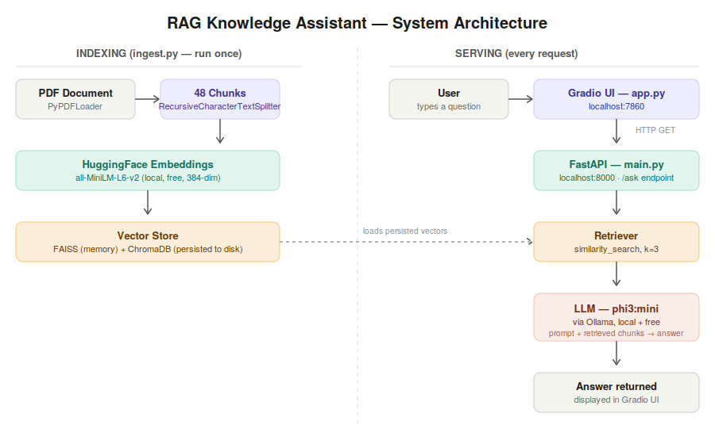

 # RAG Knowledge Assistant

A locally-running Retrieval-Augmented Generation (RAG) system that answers questions about the "Attention Is All You Need" paper, with a production-style API + UI architecture and a custom evaluation harness.

## What it does

Ask a question about the Transformer paper and get a grounded answer — generated by a local LLM, backed by real retrieved chunks from the source PDF, not the model's training memory.

## Architecture

PDF → chunk → embed → vector store (FAISS / ChromaDB)

↓

User question → Gradio UI → FastAPI backend → retrieve chunks → LLM → answer



- **Indexing** (`ingest.py`): one-time pipeline that loads the PDF, splits it into chunks, embeds them, and persists them to disk.
- **Serving** (`main.py`): FastAPI backend that loads the pre-built vector store and exposes a `/ask` endpoint.
- **Frontend** (`app.py`): Gradio UI that calls the FastAPI backend over HTTP — mirrors a real production split between frontend and backend.
- **Evaluation** (`evaluate.py`): custom LLM-judge evaluation harness scoring faithfulness and answer relevance.

## Tech stack

| Component | Tool |
|---|---|
| Orchestration | LangChain |
| Vector stores | FAISS, ChromaDB (both implemented and compared) |
| Embeddings | HuggingFace `sentence-transformers/all-MiniLM-L6-v2` (local, free) |
| LLM | Ollama — `phi3:mini` (switched from `llama3.2` due to a 4GB VRAM constraint) |
| Backend | FastAPI |
| Frontend | Gradio |
| Evaluation | Custom LLM-as-judge harness (faithfulness + relevance scoring) |

## Setup

```bash
git clone <your-repo-url>
cd rag-knowledge-assistant
pip install -r requirements.txt
```

Pull the local LLM via [Ollama](https://ollama.com):
```bash
ollama pull phi3:mini
```

Place a PDF in `data/` and update the filename in `ingest.py`, then build the vector store:
```bash
python src/ingest.py
```

## Running the app

Two servers run side by side:

```bash
# Terminal 1 — backend API
uvicorn src.main:app --reload

# Terminal 2 — frontend UI
python src/app.py
```

Open `http://127.0.0.1:7860` and ask a question.

## Evaluation results

Evaluated across 5 test questions using `phi3:mini` as an LLM judge for faithfulness (does the answer match the retrieved context?) and relevance (does the answer address the question?):

| Metric | Average Score |
|---|---|
| Faithfulness | 8.0 / 10 |
| Relevance | 7.8 / 10 |

**Finding:** the system performs strongly (9-10/10) on direct lookup questions, but drops sharply (3-4/10) on questions requiring synthesis across multiple scattered chunks — e.g. "Why did the authors choose attention over recurrent layers?" This points to a known limitation of naive fixed-size chunking: a single chunk rarely contains a complete multi-part argument.

## Known limitations & future work

- **VRAM constraint**: switched from `llama3.2` to `phi3:mini` after repeated CUDA crashes traced to a 4GB Quadro T1000 GPU running out of memory under sustained load.
- **RAGAS dependency conflict**: the official RAGAS library (`0.4.3`) depends on an internal `langchain_community` module that has since been removed in current LangChain versions. Implemented a custom LLM-judge evaluator instead.
- **Chunking strategy**: fixed-size chunking (1000 chars, 150 overlap) struggles with multi-chunk synthesis questions. Future work: semantic chunking or query decomposition.
- **FAISS vs ChromaDB**: at this dataset's scale (48 chunks), both produced identical retrieval rankings. ChromaDB was kept for its automatic disk persistence.
